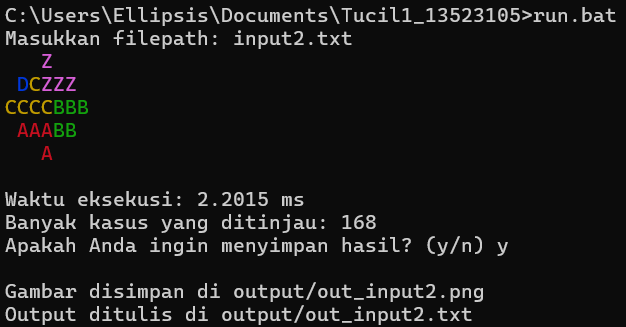

# IQ Puzzle Pro Solver


IQ Puzzle Solver adalah program yang dirancang untuk menyelesaikan puzzle IQ menggunakan algoritma brute-force. Program ini mencoba menempatkan potongan-potongan puzzle ke dalam sebuah papan (board) dengan cara:
- Mencari sel kosong (sel dengan nilai 0)
- Mencoba menempatkan potongan (dengan berbagai varian bentuk) pada posisi tersebut
- Melakukan pencarian secara bruteforce dengan stack.

Solusi yang ditemukan akan ditampilkan di konsol dengan representasi warna berdasarkan label potongan, serta disimpan sebagai file gambar.

## Struktur Proyek
```
Tucil1_13523105/
├── bin/
├── doc/
├── output/
├── src/
│   ├── datatypes/
│   │   ├── Pair.java
│   │   └── Tuple5.java
│   └── models/
│       ├── FileProcessing.java
│       ├── GenerateVariants.java
│       ├── IQPuzzleSolver.java
│       └── ImageGenerator.java
├── test/
├── LICENSE
├── Main.java
├── README.md
└── run.bat
```

## Instalasi
### 1. Linux
```
sudo apt install openjdk-17-jdk
```
### 2. Windows
Instal Java 17 ke atas pada link berikut. https://www.oracle.com/id/java/technologies/downloads/

## Cara Menjalankan Program

### 1. Kompilasi
Pastikan JDK telah terinstall. Dari direktori root proyek, kompilasi dengan
```bash
javac -d bin Main.java
```

### 2. Menjalankan
Dari direktori `bin`, jalankan program dengan perintah:
```bash
java -cp bin Main
```

### 3. Cara Mudah
Gunakan perintah berikut untuk windows.
```
./run.bat
```

## Input dan Output

### Input
Program menerima input melalui objek `Tuple5` yang memuat:
- **Dimensi Board:** Nilai `N` (baris) dan `M` (kolom)
- **Jumlah Potongan:** Nilai `P`
- **Board:** Array dua dimensi (`int[][]`)
- **List Potongan:** `List<Pair<Character, List<List<List<Integer>>>>>` yang berisi label potongan dan varian bentuk (representasi matriks 0/1)

### Output
- **Konsol:** Menampilkan board dengan penempatan potongan, dengan warna berbeda untuk tiap potongan.
- **Gambar:** Solusi disimpan sebagai file gambar menggunakan kelas `ImageGenerator`.
- **TXT File:** Solusi ditulis sebagai file txt menggunakan kelas `FileProcessing`.

### File Input
```
N M P
BoardType
<Piece 1>
<Piece 2>
...
<Piece P>
```
Lihat contoh pada folder test.

## Usage
Ketik `<nama_file>` dengan format txt seperti `input2.txt` setelah program dijalankan.




## Author
| Nama | NIM | Kelas |
|------|---|---|
| Muhammad Fathur Rizky | 13523105 | K02 |  
